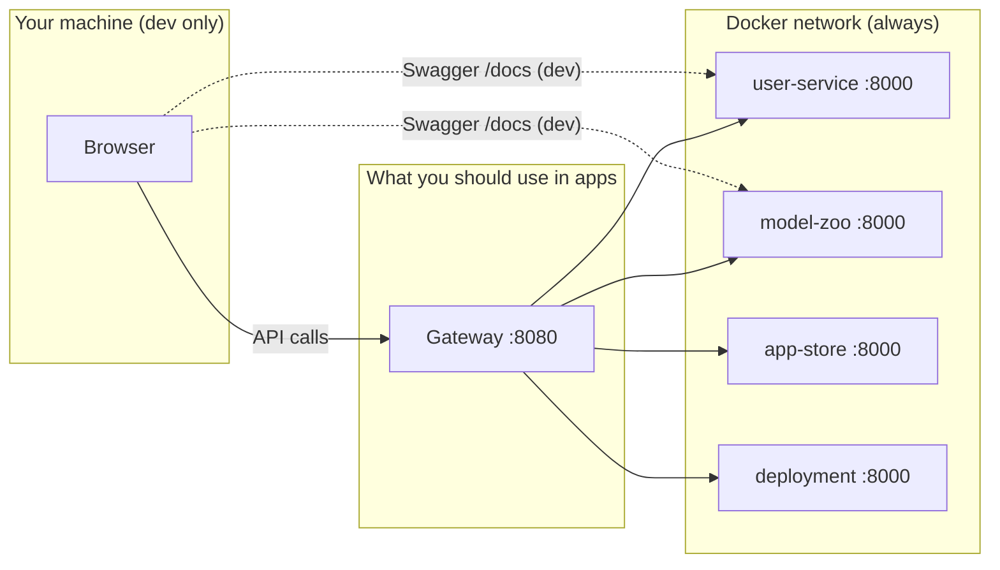

# Microservices & ports — how this backend works

## Short answer

**Yes, separate services are how microservices work** — but **8000, 8001, 8002, 8003 on your PC are only for local debugging**, not how production works.

In production, clients use **one URL** (gateway on `:8080` or `https://api.yoursite.com`). They never see individual service ports.

---

## Two layers of “ports”



| Port | Who uses it | Purpose |
|------|-------------|---------|
| **8080** | Frontend, Postman, devices | **Single entry point** — nginx gateway routes `/api/v1/*` |
| **8000–8003** | You (developer) | **Optional** — direct access to each service’s `/docs` and debugging |
| **8000 (inside Docker)** | Gateway → service | Every container listens on 8000 **internally**; Docker DNS names them (`user-service`, `model-zoo-service`, …) |

Inside Docker, **all services can use port 8000** because each has its **own container**. They don’t conflict. Host ports 8000–8003 are only needed to reach them from **outside** Docker (your browser).

---

## How microservices communicate

Services talk to each other by **service name + internal port**, not by localhost:

```text
deployment-service  →  http://model-zoo-service:8000/internal/models/{id}/artifact
deployment-service  →  http://app-store-service:8000/internal/apps/{id}/artifact
gateway (nginx)     →  http://user-service:8000
```

Your browser uses **`localhost:8080`**. Containers use **`user-service:8000`** on the Docker network.

That is standard microservice networking.

---

## What you should use day to day

### Building a frontend or testing APIs

Use **only the gateway**:

```text
http://localhost:8080/api/v1/auth/login
http://localhost:8080/api/v1/models
http://localhost:8080/api/v1/apps
http://localhost:8080/api/v1/deployments
```

### Exploring Swagger for one service

Use **dev ports** (when published in compose):

| Service | Docs |
|---------|------|
| user-service | http://localhost:8000/docs |
| model-zoo-service | http://localhost:8001/docs |
| app-store-service | http://localhost:8002/docs |
| deployment-service | http://localhost:8003/docs |

There is **no single combined Swagger** — each microservice owns its own OpenAPI spec. That is normal.

---

## Production (Render, DigitalOcean, Kubernetes)

| Environment | Pattern |
|-------------|---------|
| **Render / DO App Platform** | One public URL per deployed component, or one gateway |
| **Kubernetes** | All pods listen on 8000; **Ingress** exposes one hostname |
| **This repo on a Droplet** | Only **80/443** (gateway) public; block 8000–8003 from the internet |

You do **not** expose 8000–8003 publicly in production.

---

## Why not one big app on one port?

Microservices split by **business capability**:

- **user-service** — auth (can scale / deploy independently)
- **model-zoo-service** — files + catalog (needs storage volume)
- **deployment-service** — QR + proxy (talks to zoo + app store)

Benefits later: separate teams, separate deploys, separate scaling (e.g. heavy training workers without touching auth).

Tradeoff: more moving parts locally — gateway + multiple containers — which is what you’re seeing.

---

## Summary

| Question | Answer |
|----------|--------|
| Is 8000–8003 “how microservices work”? | **Partially.** Separate **processes/services** yes; separate **host ports** are **dev convenience** only. |
| What should my app call? | **`http://localhost:8080`** (gateway) |
| Why can’t one `/docs` show everything? | Each service is a separate FastAPI app with its own routes. |
| Inside Docker, same port 8000? | Yes — different containers, no conflict. |
